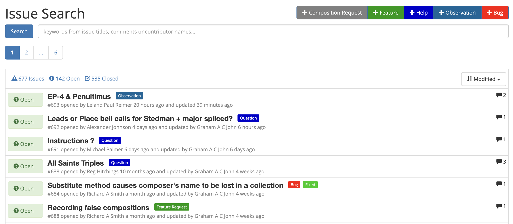

# About the Help

The Composition Library, or Complib, is a powerful resource offering a wide array of features to its users. An unfortunate downside is that the website can be unintuitive to use. Our hope is that this documentation can help you get to grips with Complib and how it works.

## Giving feedback

The Composition Library is a work-in-progress, and the Help contained here is no different. You can provide feedback on the Help via Complib's [Issues](hhtps://complib.org/issue/search) page.

When raising a help-specific issue, please use the dedicated **Documentation** issue type, as that will allow us to deal with it separately from issues specific to Complib itself.

## When to raise an issue
If...

- you encounter a problem when using the Help; 
- you notice something about the Help which doesn't seem correct (and you're reasonably sure);
- you have feedback about a section of the Help which is unclear or could be expanded upon (and you have reason to believe that this isn't being done already);
- you have feedback about the way the Help is structured;

then these are good reasons to raise an issue.

## When not to raise an issue
There are certain circumstances under which we would ask you not to raise an issue.

Change ringing is an art with a very long history, and its technical aspects have been subject to constant development within the change ringing community for centuries. Complib is intended to serve the needs of change ringing **as it is currently practiced**. To this end, both Complib and the Help reflect the current [Central Council Framework for Method Ringing](https://framework.cccbr.org.uk/version2/index.html) wherever possible.

Neither Complib itself nor this Help documentation are designed to act as fora for debate on the details of the current Framework, nor indeed should they. Such debate is a crucial part of change ringing culture, but this is not the appropriate place for it.

