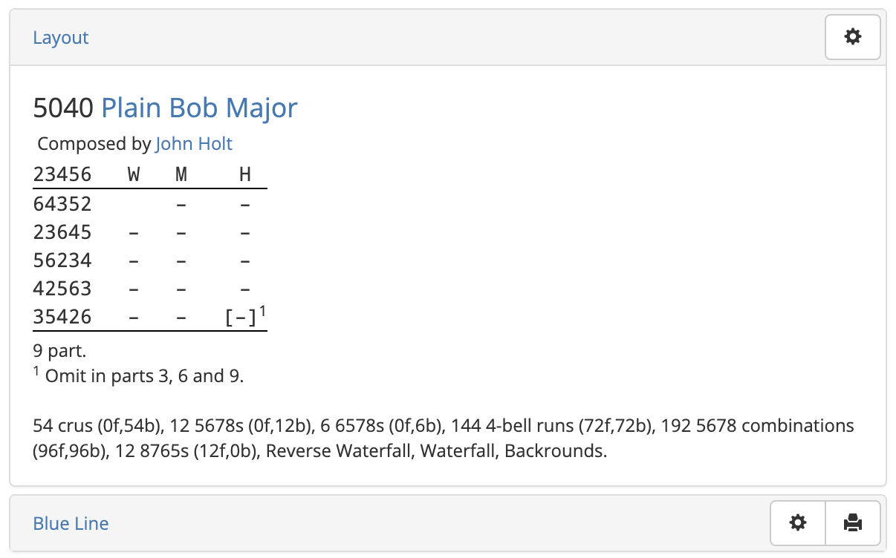

# Composition Pages

As its name suggests, Complib has been designed as a library for change ringing **compositions**. In the most general terms, a composition is a specified **calling** for a change ringing performance. A composition is stored in Complib as this calling, together with specified method(s) for which it has been designed.

Complib automatically **pricks** (i.e. generates the rows of) any composition when it is entered in order to establish its **truth**. Stored compositions are then given their own dedicated page, which has a number of expandable tabs:

Layout
:   The human-readable form of the composition. Users can adjust the form and style of the layout to suit a wide variety of needs and preferences (see [Customising composition layouts](layout_options.md)).

Blue Line
:   The pricked rows of the composition, with (or without) an overlaid blue line.

Music Score
:   The music score breakdown of the composition with respect to a specified **music scheme**. Users can use one of the default schemes (including for half-muffled ringing), or specify their own.

Handbell Positions
:   A table specifying which positions each handbell pair rings during the composition, as well as the number of leads rung (if applicable) and their relative prevalence.

Properties
:   The technical features of the composition, such as its **length**, **number of parts**, whether it is **all-the-work**, and more.

Related Compositions
:   A list of all compositions which are related to the current one, i.e., because they are related by some **transformation** such as rotation or reversal, or because they have the same calling but different specified methods.

Performances
:   Historical information about occasions when the composition has been performed,  with links to the relevant Bellboard page.

References
:   A list of all accessible **collections** containing the current composition. If you own a private collection containing the composition, it will be included here.

Library Details
:   Information pertaining to the composition's Complib entry, including which **library** it is contained in, the corresponding **Composition Id**, any **Notes** included by the publisher, etc.