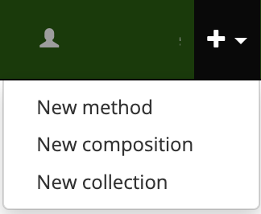
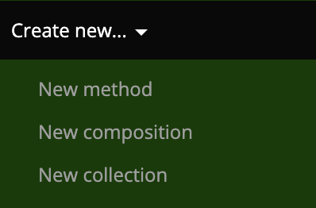
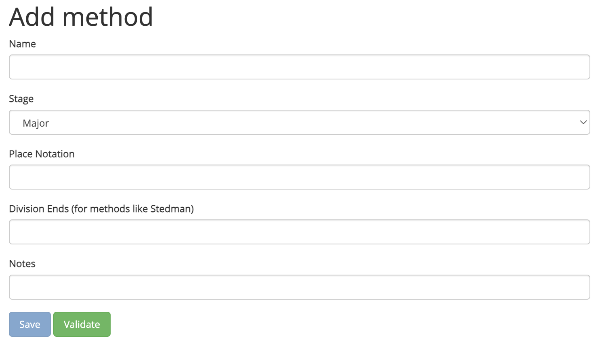

# Adding Methods
Complib gives registered users the ability to create methods of their own.

To get started, click on **Create new > New method** in the navbar or dropdown menu:

{ width="300" }
{ width="300" }

## The add method page

## Private and public methods

### Sharing private methods

## Editing and deleting methods

## Linking Bellboard performances

