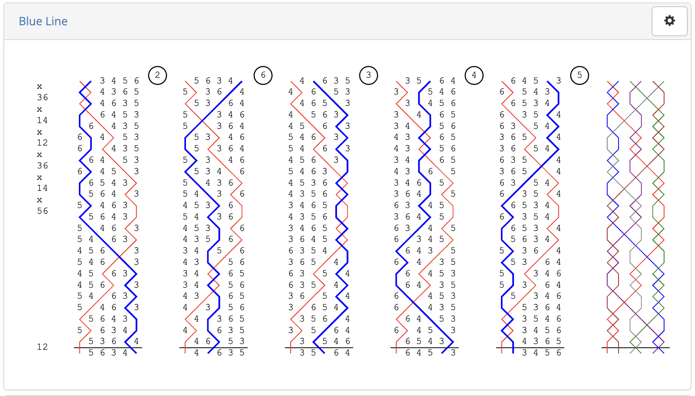
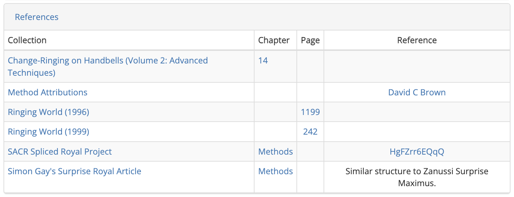

# Method pages

Complib acts as a method collection, and has dedicated pages for all officially named methods in the Central Council's Method Library. Methods within this library are regularly updated, and new methods automatically added, in order to keep the collection up to date. 

When a method is added, Complib automatically classifies it and derives its various properties. It then creates a page for the method where all relevant information can be viewed. For example, the method page for [Bristol Surprise Major](https://complib.org/method/19048/) looks something like this:

The method's **name** is displayed at the top. If this name has changed since the method was first rung, all previous name(s) will be displayed underneath the current name.

## Toolbar

To the side of the method's name is the **toolbar**:

The toolbar buttons can be identified by hovering over them. They are, from left to right:

Find compositions true to this
:   Begins an **entended search** of all Complib compositions to determine which ones can be rung with this method (see [Extended searches](../search/extended.md)).

Add to collection
:   Adds the method to a **collection** of your choice (see [Collections](../collections/overview.md)).

Clone
:   Creates a clone of the method in the **method editor** which you can then edit (see [Adding methods](adding_methods.md)).

Share
:   Displays a public link to the method page so it can be shared with others.

Export rows
:   Opens another tab displaying all the **rows** of the method's plain course in plaintext format.

Printable version
:   Opens a new tab displaying the contents of the [blue line](#blue-line) tab in a form which is easy to print.

!!! note
    The `Find compositions true to this`, `Add to collection` and `Clone` buttons are only available to registered users. If you are not logged in, these buttons will not be displayed.

## Tabs overview
The majority of the page is subdivided into various expandable tabs (click on the name of a tab to skip to a detailed description of its contents):

[Blue Line](#blue-line)
:   A visual representation of the method.

[Properties](#properties)
:   The structural properties of the method, including its **place notation**, **leadhead group**, **extension path** (if applicable) and more. A large amount of this information pertains to the method's **classification**, which derives from the Central Council's [Framework for Method Ringing](https://framework.cccbr.org.uk/version2/index.html).

[Related Methods](#related-methods)
:   Any methods which are related to the current method, such as **halflead/leadend variants** and methods belonging to the same **extension family** (whether compliant with the Central Council Framework or not).

[Trivial Variations](#trivial-variations)
:   Any methods which are considered to be **trivial variations** of the current method.

[Performances](#performances)
:   Historical information about occasions when the method has been performed, including when it was first rung and named and any recognised record lengths, with links to the relevant Bellboard performance (if provided).

[References](#references)
:   A list of all accessible **collections** containing the method. If you own a private collection containing the method, it will be listed here.

[Library Details](#library-details)
:   The method's Complib-specific metadata including which **library** it is contained within, the corresponding **method ID**, and its dates of creation, publication, etc.

## Blue line

This tab renders a visual representation of the method. By default, this is done in the traditional *Diagrams* style with all hunt bells plus a single working bell drawn in coloured lines. The method's **grid**, which consists of a single lead/division with all bells drawn in coloured lines, is also shown by default.

The appearance of the blue line display is highly customisable. For more information about how to adjust the display style, see [Customising blue lines](blueline_options.md).

!!! note
    You need to be logged in as a registered user to adjust the Blue Line display style.

## Properties

For an explanation of the information contained in the properties tab, see [Understanding method properties](method_properties.md/#the-properties-tab).

## Related methods

Methods may be **related** to other methods in a number of different ways. Named methods which are related to the current method in any of the following ways will be listed in this tab in the appropriate field.

Halflead/leadend variants
:   A halflead/leadend variant of a method is any method which differs from it only by which place is made at the halflead/leadend. For example, [Cambridge Surprise Minor](https://complib.org/method/14568) and [Primrose Surprise Minor](https://complib.org/method/14570) are leadend variants.

!!! tip
    Hovering over the name of a halflead/leadend variant will indicate the way in which its halflead (HL) and/or leadend (LE) differs from the current method.

Reverse
:   The reverse of a method is the method obtained by reversing all its rows. Equivalently, it is the method obtained by **inverting** the method's place notation (see [Place notation](place_notation.md)).

Double work above/below
:   For methods with a single hunt bell, the combination of the work done above/below the hunt bell with an inverted copy of itself will give a double method, which may or may not have been named.

Extensions
:   Two methods at **differing stages** are extensions of one another if they are related by any of the recognised **extension paths**. If the method can be extended using any of the recognised extension paths, all methods in the path will be listed up to stage Twenty-Eight (see [Extensions](../advanced/extensions.md)).

Non-conforming extensions
:   If two methods share the same name and class but are not related by any of the recognised extension paths, then they are **non-conforming extensions** of one another. Methods with non-conforming extensions will typically have been named and rung before the formal framework of method extension was developed. A previously non-conforming extension may become a conforming extension in the event that: 

    - a new extension pathway becomes recognised; and
    - the previously non-conforming extension can be obtained by application of that new pathway.

## Trivial variations

This tab lists all named methods which are related to the current method by means of a **trivial variation**, together with their place notations. Trivial variations are ways of slightly altering the blue line of a method without changing its overall structure.

The image above shows the first leads of [Yorkshire Surprise Major](https://complib.org/method/17060) (left) and [Quedgeley Surprise Major](https://complib.org/method/17064) (right), which are trivial variations of each other. It can be seen by inspection that the two are almost identical, with only slight differences in the blue line.

It is important to note that the word trivial is not a value judgement: it does **not** imply that one method is inherently more original or "valuable" than another. It is a purely technical classification which identifies a similarity in their constructions. 

The property of trivial variation is a symmetric relationship: if method B is a trivial variation of method A, then method A is necessarily a trivial variation of method B.

Contrary to the name, a method might differ from its trivial variants in decidedly non-trivial ways. They may not share exactly the same rows, and subsequently may have different false coursehead groups, among other things. A consequence of this is the following:

!!! warning
    A composition which is true for one method is **not necessarily true** for all (or indeed any) of its trivial variations. You should always check a composition is true for the specific method you wish to ring.

## Performances

This tab lists any documented performances of the method which have been added to its Complib page. Each entry has three fields:

Date
:   The date on which the performance was rung.

Type
:   Specifies one of a number of different performance types:

    - **First inclusion in a peal/quarter peal/etc.**: a multi-method performance where the method is recognised to have been rung for the first time.
    - **First peal/quarter peal/etc.**: a single-method performance where the method is recognised to have been rung for the first time (or, for methods previously rung in a multi-method performance, the first time it was rung by itself).
    - **First extent**: for methods at stages Minor and below, a performance containing an extent of the method at that stage where the method is recognised to have been rung for the first time.
    - **Long Length**: a performance of 10,000 changes or more.

    Performances are further typified by whether they were rung on towerbells or handbells.

Details
:   The published details of the performance: title, performing Guild or Association (if given), location, and conductor (if given). The entry in this field acts as a link to the corresponding Bellboard performance, provided it exists and has been linked to the method page (see [Linking Bellboard performances](adding_methods.md/#linking-bellboard-performances)).

!!! note
    Performance information exists only for those methods where it has been manually added to the corresponding method page. Many methods have no added performances, but this should not be taken to mean that the method has never been performed.

## References

This tab lists all collections which you have access to and which reference the current method (inaccessible private collections will not be displayed). Each entry has four fields, with every entry acting as a link to the relevant Complib page:

Collection
:   The name of the collection to which the method belongs.

Chapter (optional)
:   The chapter of the method's entry in the collection (if specified).

Page (optional)
:   The page number of the method's entry in the collection (if specified).

Reference (optional)
:   In the case that the collection is **referenced** by a certain index, the corresponding reference for the method within the collection.

For more on references and how they relate to collections, see [Collections](../collections/overview.md).

## Library details

This tab lists some of the method's Complib-specific metadata.

Library
:   The smallest [library](../concepts.md/#the-libraries) which contains the method. Methods in the `Provisional` library will be listed as `Public`.

Notes
:   Any notes provided by the method's publisher (see [Adding methods](adding_methods.md)).

Method Id
:   The method's numerical ID. This is the number featured at the end of a method page's URL.

Created on
:   The date and time at which the method was created and the name of the user who created it.

!!! note
    Times and dates are given in Coordinated Universal Time (UTC).

Modified on
:   The date and time at which the method was last modified and the name of the user who modified it.

Published on
:   The date and time at which the method was made public.
